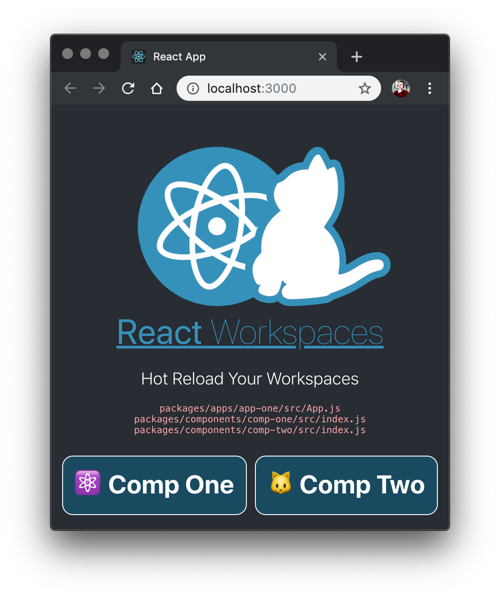

# CRA Workspaces Playground



Starting a CRA Monorepo with Yarn Workspaces support is as easy as:

```shell
create-react-app --scripts-version @react-workspaces/react-scripts@2.1.1-workspaces-07 my-app
```

- What's this about? https://github.com/facebook/create-react-app/issues/1333#issuecomment-439275517

## Testing this playground

To download and test a CRA Workspaces Monorepo, do this:

```shell
git clone git@github.com:react-workspaces/cra-workspaces-playground.git
cd cra-workspaces-playground
yarn
cd apps/app-one
yarn start
```

Update the `components/comp-one/src/index.js` to see the live changes to the `<CompOne>` component.

## Detailed Steps

The following steps detail how to setup a CRA Workspaces Monorepo from scratch:

1. Initialize your Lerna repo:

    > `~/repos/cra-workspaces-playground` is your `<workspaces-root>`

    ```shell
    mkdir ~/repos/cra-workspaces-playground
    cd ~/repos/cra-workspaces-playground
    lerna init
    ```

    Update lerna.json to use yarn workspaces...

    Change file `<workspaces-root>/lerna.json`:

    ```json
    {
        "useWorkspaces": true,
        "packages": [
            "packages/*/*"
        ],
        "version": "1.0.0",
        "command": {
            "run": {
            "npmClient": "yarn"
            }
        }
    }
    ```

2. Add your workspaces to your package.json:

    `<workspaces-root>/package.json`:

    ```json
    {
        "name": "root",
        "private": true,
        "devDependencies": {
            "lerna": "^3.4.0"
        },
        "workspaces": [
            "packages/apps/*",
            "packages/components/*"
        ]
    }
    ```

3. Create your package directories:

    ```shell
    cd ~/repos/cra-workspaces-playground
    mkdir packages packages/apps packages/components
    ```

4. Create your React App with custom React-Sripts:

    ```shell
    cd ~/repos/cra-workspaces-playground/packages/apps
    create-react-app --scripts-version @react-workspaces/react-scripts@2.1.1-workspaces-07 app-one
    ```

5. Create a React component:

    ```shell
    cd ~/repos/cra-workspaces-playground/packages/components
    mkdir comp-one
    cd comp-one
    ```

    Write to file `<workspaces-root>/packages/components/comp-one/package.json`:

    > Note the user of `main:src` instead of `main`:

    ```json
    {
        "name": "@project/comp-one",
        "version": "1.0.0",
        "main": "src/index.js"
        "main:src": "src/index.js"
    }
    ```

    Add some code for your React component:

    ```shell
    cd ~/repos/cra-workspaces-playground/packages/components/comp-one
    mkdir src
    cd src
    ```

    Write to file `<workspaces-root>/packages/components/comp-one/src/index.js`:

    ```js
    import React from 'react';

    const CompOne = () => <div className="Comp">
        <h3><span role="img" aria-label="React Logo">⚛️</span>  Comp One</h3>
    </div>;

    export default CompOne;
    ```

6. Update your React App to include the dependency for CompOne:

    ```shell
    cd ~/repos/cra-workspaces-playground/packages/apps/app-one
    ```

    Change file: `<workspaces-root>/apps/app-one/package.json`:

    ```json
    {
        "name": "app-one",
        "version": "0.1.0",
        "private": true,
        "dependencies": {
            "@react-workspaces/react-scripts": "2.1.1-workspaces-07",
            "react": "^16.6.3",
            "react-dom": "^16.6.3",
            "@project/comp-one": "1.0.0"
        },
        "scripts": {
            "start": "react-scripts start",
            "build": "react-scripts build",
            "test": "react-scripts test",
            "eject": "react-scripts eject"
        },
        "eslintConfig": {
            "extends": "react-app"
        },
        "browserslist": [
            ">0.2%",
            "not dead",
            "not ie <= 11",
            "not op_mini all"
        ]
    }
    ```
7. Use your component in your React App:

    Update file `<workspaces-root>packages/apps/app-one/src/App.js`:

    ```js
    import React, { Component } from 'react';
    import logo from './logo.svg';
    import './App.css';
    import CompOne from '@project/comp-one';

    class App extends Component {
        render() {
            return (
            <div className="App">
                <header className="App-header">
                
                <p>
                    Edit <code>src/App.js</code> and save to reload.
                </p>
                <a
                    className="App-link"
                    href="https://reactjs.org"
                    target="_blank"
                    rel="noopener noreferrer"
                >
                    Learn React
                </a>
                <CompOne />
                </header>
            </div>
            );
        }
    }

    export default App;
    ```

8. Test your app:

    Re-link and build fresh packages:

    ```shell
    cd ~/repos/cra-workspaces-playground/
    yarn
    ```

    Start your app:

    ```shell
    cd apps/app-one
    yarn start
    ```

9. Finished!

    You should see your React app launched with your component. Try editing your component and test hot-reloading. 😄
